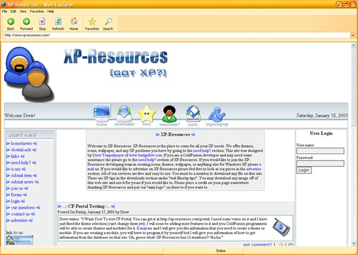



## Web Explorer

### Description

Web Explorer is one of the best internet browser on Planet Source Code. It offers a Windows XP Interface with it. Please look at the screen shot and you'll love it. Requires common controls 6.
 
### More Info
 

             |
---                |---
**Submitted On**   |2003-01-18 10:54:16
**By**             |[Drew Tempelmeyer](https://github.com/Planet-Source-Code/PSCIndex/blob/master/ByAuthor/drew-tempelmeyer.md)
**Level**          |Advanced
**User Rating**    |3.4 (17 globes from 5 users)
**Compatibility**  |VB 6\.0
**Category**       |[Internet/ HTML](https://github.com/Planet-Source-Code/PSCIndex/blob/master/ByCategory/internet-html__1-34.md)
**World**          |[Visual Basic](https://github.com/Planet-Source-Code/PSCIndex/blob/master/ByWorld/visual-basic.md)
**Archive File**   |[Web\_Explor1531121182003\.zip](https://github.com/Planet-Source-Code/drew-tempelmeyer-web-explorer__1-42533/archive/master.zip)

